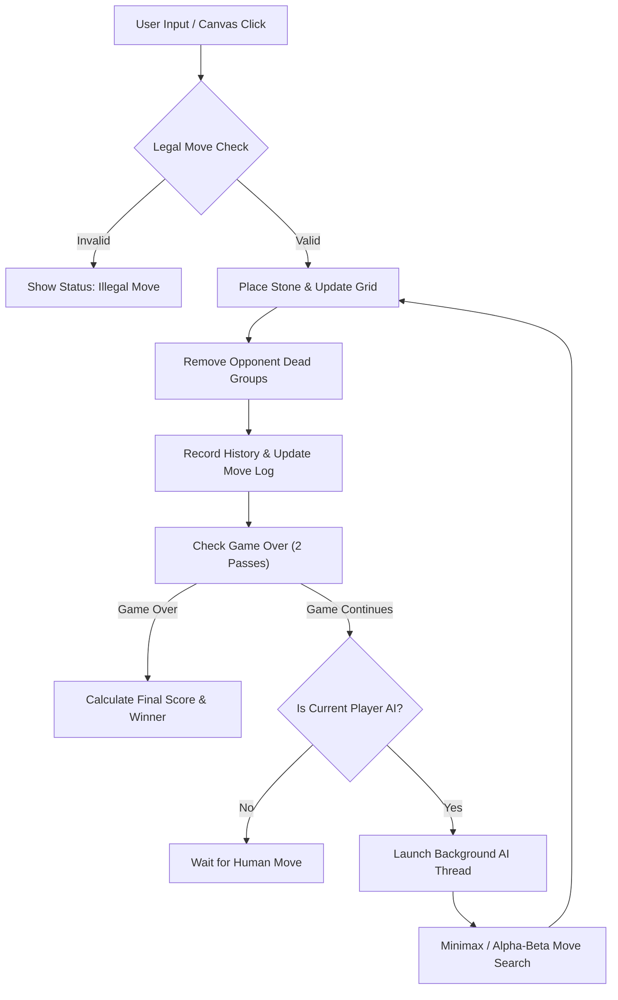

# Go Game

A modern, interactive desktop implementation of the ancient board game **Go** built with **Python** and **CustomTkinter**. It features an AI powered by Minimax decision trees with Alpha-Beta pruning optimization.

---

## 🚀 Quick Start

### 1. Prerequisites
Ensure Python 3.8+ is installed on your system. Install the required GUI package:

```bash
pip install customtkinter
```

### 2. Running the Game
Launch the application by running:

```bash
python go_game.py
```

---

## 🎮 Features & Controls

- **Interactive Board**:
  - Click grid intersections to place stones.
  - Hover over intersections to see a **dashed ghost stone preview** of your move.
- **Board Size Selection**: Instantly switch between `5x5` (Fast), `9x9` (Classic), `13x13` (Standard), and `19x19` (Pro).
- **AI Side Selection**: Choose `White AI` (Default), `Black AI`, `Both AI` (Autoplay), or `No AI` (Local 2-Player).
- **AI Strength Adjustment**: Adjust search depth from Level 1 (Beginner) to Level 5 (Expert).
- **Alpha-Beta Toggle**: Switch between standard Minimax and optimized Alpha-Beta Pruning.
- **Game Actions**:
  - **PASS**: Pass your turn to the opponent.
  - **UNDO**: Revert the last played move.
  - **NEW GAME**: Reset the board to start fresh.
- **Move History Log**: Terminal-style dark log displaying moves, evaluated nodes, and AI execution times.

---

## 🧠 Algorithms & Logic

### 1. Minimax Algorithm
Minimax is a decision-making algorithm for two-player zero-sum games. The AI constructs a decision tree of possible future moves, assuming:
- The **maximizing player** (AI) attempts to maximize its heuristic score.
- The **minimizing player** (Opponent) attempts to minimize the AI's score.

### 2. Alpha-Beta Pruning
Alpha-Beta Pruning optimizes Minimax by skipping (pruning) tree branches that cannot influence the final decision:
- **$\alpha$ (Alpha)**: The maximum score the maximizing player is assured of.
- **$\beta$ (Beta)**: The minimum score the minimizing player is assured of.
- Branch cutoffs occur whenever $\beta \le \alpha$, dramatically reducing the number of evaluated board nodes.

### 3. Heuristic Evaluation Function
The board evaluation function $H(s)$ combines material and positional advantage:
$$H(s) = (\text{Stones}_{\text{AI}} - \text{Stones}_{\text{Opp}}) + (\text{Captures}_{\text{AI}} - \text{Captures}_{\text{Opp}}) + 0.5 \times (\text{Territory}_{\text{AI}} - \text{Territory}_{\text{Opp}})$$

### 4. Flood-Fill (Breadth-First Search)
- Used to detect stone groups (connected chains of identical color).
- Calculates group **liberties** (adjacent empty intersections).
- Handles automatic removal of captured dead groups (groups with 0 liberties).
- Estimates controlled territory when scoring at game end.

---

## 🔄 Application Architecture & Execution Flow



1. **GUI & Rendering Loop**: Responsive canvas renders grid lines, hoshi points, stone shadows, last move highlight, and hover previews.
2. **Asynchronous AI Execution**: AI calculations run in background daemon threads (`threading.Thread`) so the user interface remains smooth and responsive during move search.
3. **Game Termination**: Two consecutive passes trigger game completion, performing full stone count and territory estimation.

---